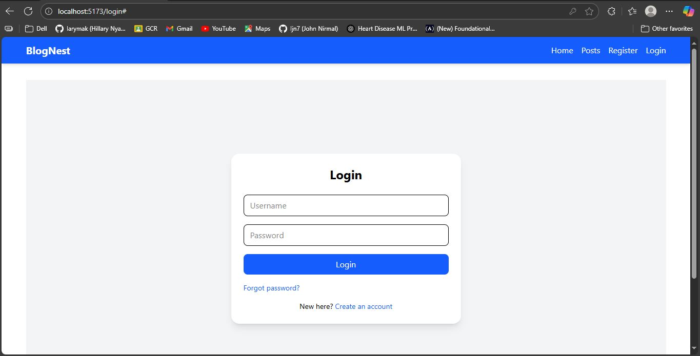
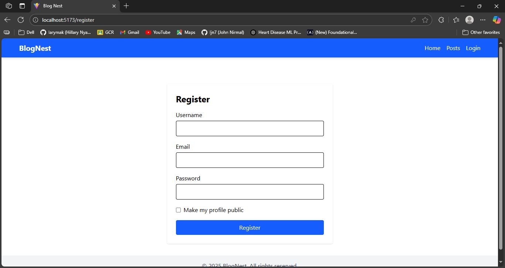
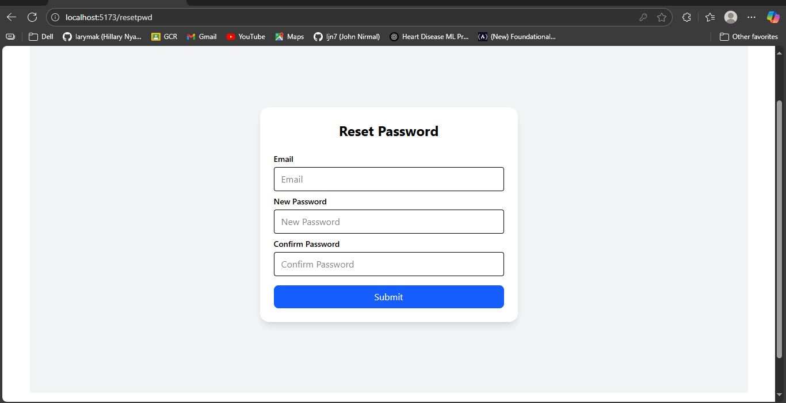
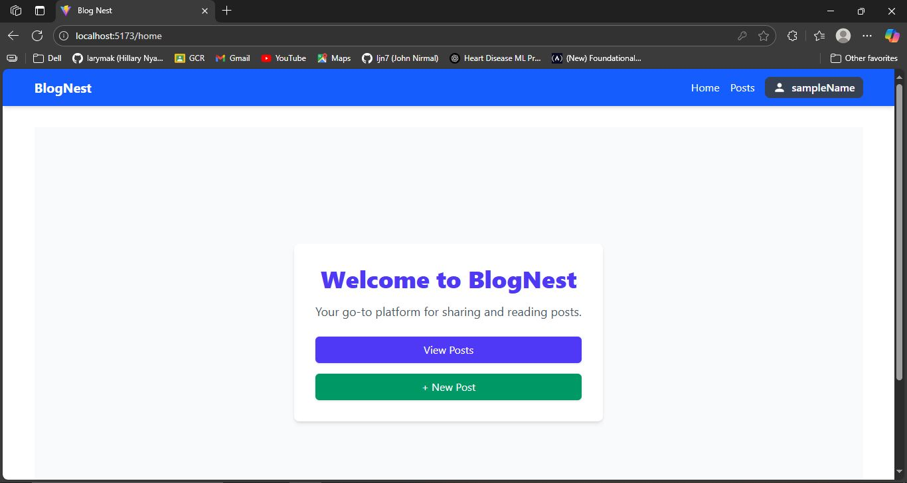
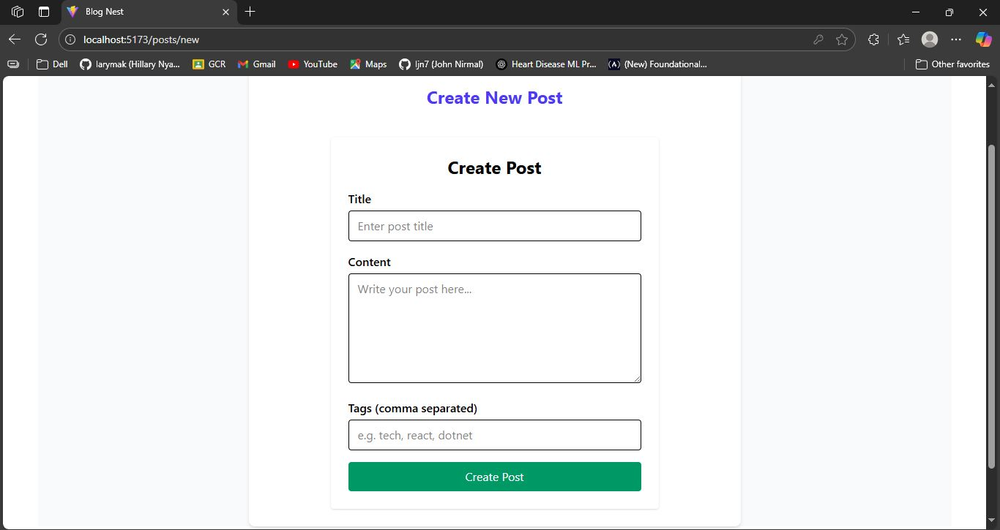
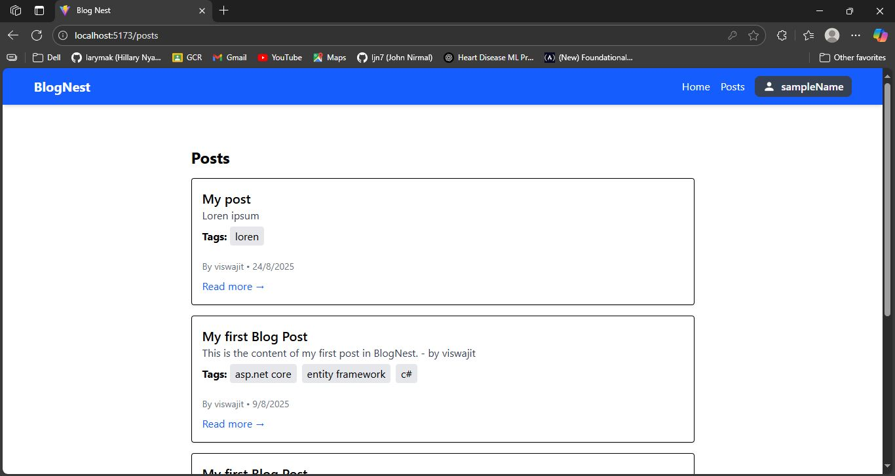
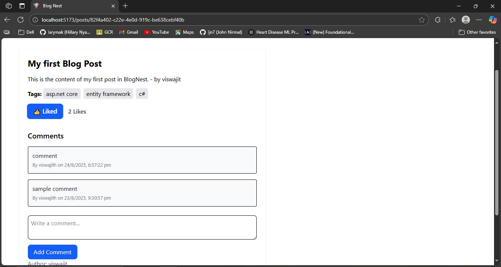
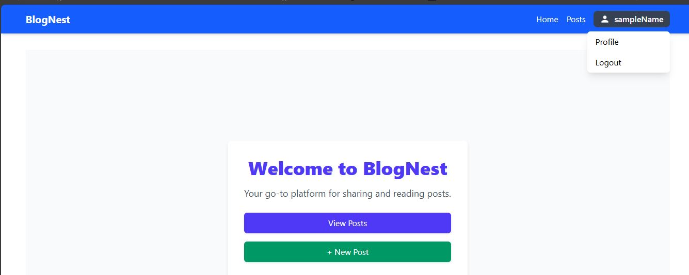

# 📝 BlogNest

  
  


A **full-stack blog platform** built with **ASP.NET Core Web API**, **React + TypeScript**, **Tailwind CSS**, and **PostgreSQL**. Users can register, login, create/edit posts, comment, like, and reset passwords.

---

## 🚀 Features

- User registration & login with **JWT authentication**  
- Forgot / Reset Password functionality  
- Create, read, update, delete blog posts  
- Like posts and comment system  
- Responsive UI with Tailwind CSS  
- Secure endpoints with role-based authorization  

---

## 📸 Screenshots

### **Login Page**


### **Register Page**


### **Forgot Password**


### **Home Page**


### **Create Post**


### **Posts Listing**

### **Individual Post / Comments**


### **Logout Click**



---

## 🛠️ Tech Stack

| Frontend      | Backend       | Database       | Others          |
|---------------|---------------|----------------|----------------|
| React + TS    | ASP.NET Core  | PostgreSQL     | Tailwind CSS    |
| React Router  | EF Core       |                | Axios           |
| React Context | JWT Auth      |                | Swagger         |

---

## ⚙️ Setup

1. Clone the repository:

```bash
git clone https://github.com/yourusername/BlogNest.git
```

2. Backend:

```bash
cd BlogNest/BlogNest
dotnet restore
dotnet run
```

3. Frontend:

```bash
cd BlogNest/BlogNestReactApp
npm install
npm run dev
```

4. Access in browser: `http://localhost:5173`

---

## 🔗 Links

- [Backend Documentation](./docs/Setup-dotnet.md)  
- [Frontend Documentation](./docs/Setup-reactapp.md)  
- [Project Plan & Workflow](./docs/PlanandWorkflow.md)
